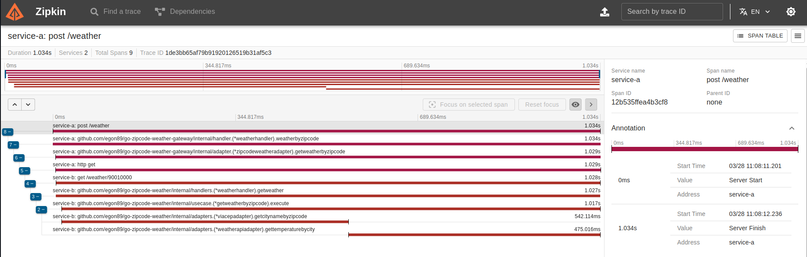
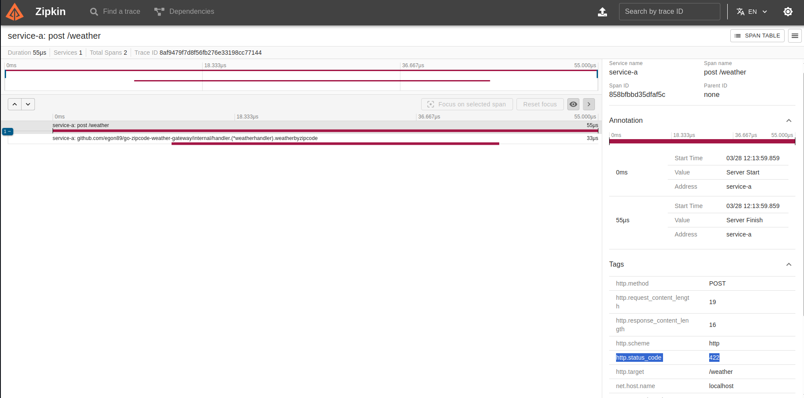
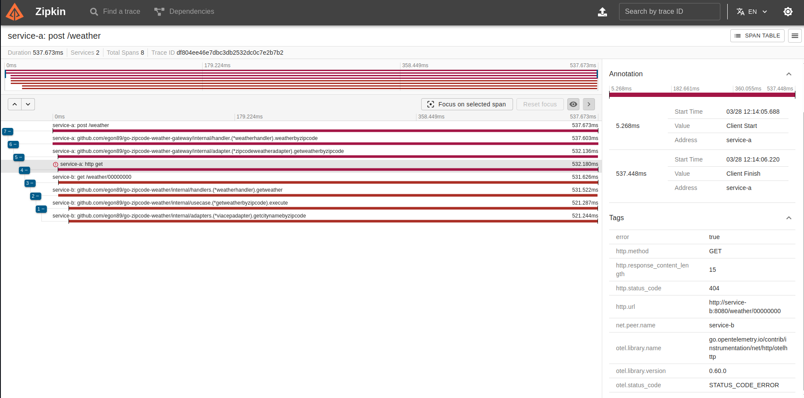
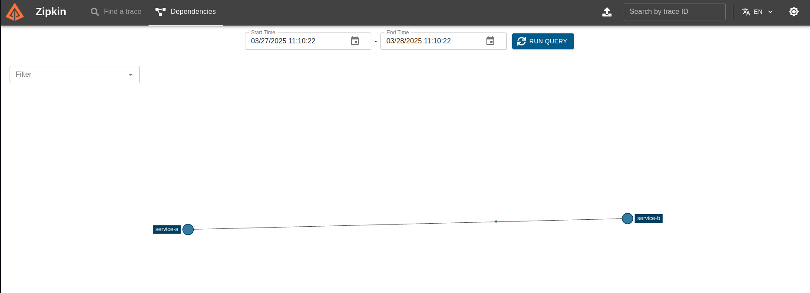

# go-zipcode-weather-otel

## Lab requirements
Objective: Develop a system in Go that receives a ZIP code, identifies the city, and returns the current weather (temperature in Celsius, Fahrenheit, and Kelvin) along with the city. This system must implement OTEL (Open Telemetry) and Zipkin.

Based on the known scenario "Temperature System by ZIP Code" called Service B, a new project will be added, called Service A.
 
### Requirements - Service A (responsible for input):

- The system must receive an 8-digit input via POST, using the schema: { "cep": "29902555" }
- The system must validate if the input is valid (contains 8 digits) and is a STRING
    - If valid, it will be forwarded to Service B via HTTP
    - If not valid, it must return:
        - HTTP Code: 422
        - Message: invalid zipcode

### Requirements - Service B (responsible for orchestration):

- The system must receive a valid 8-digit ZIP code
- The system must search for the ZIP code, find the location name, and return the temperatures formatted in Celsius, Fahrenheit, and Kelvin along with the location name.
- The system must respond appropriately in the following scenarios:
    - In case of success:
        - HTTP Code: 200
        - Response Body: {"city": "São Paulo", "temp_C": 25.1,"temp_F": 77.2, "temp_K": 298.3}
    - In case of failure, if the ZIP code is not valid (correct format):
        - HTTP Code: 422
        - Message: invalid zipcode
    - In case of failure, if the ZIP code is not found:
        - HTTP Code: 404
        - Message: cannot find zipcode

### Open Telemetry + Zipkin

After implementing the services, add the implementation of OTEL + Zipkin:
- Implement distributed tracing between Service A and Service B
- Use spans to measure the response time of the ZIP code search service and the temperature search service

## How to run

Create the `.env` file following the `.env.example` file for **each service**.

For the **Service B**, you will need to create an API key from [Weather API](https://www.weatherapi.com/) to use it in the environment variable `WEATHER_API_KEY`.

You can use the following commands:
- `make run`: run the services
- `make rund`: run the services in detached mode
- `make down`: stop and remove the services

## How to use

You can use the following commands:
- `make zipcode_poa`: send a request to the Service A with the ZIP code of Porto Alegre
- `make zipcode_sp`: send a request to the Service A with the ZIP code of São Paulo
- `make zipcode_invalid`: send a request to the Service A with an invalid ZIP code
- `make zipcode_not_found`: send a request to the Service A with a ZIP code that not exists

You can also use the following curl command:
```bash
curl -X POST http://localhost:8081/weather -H "Content-Type: application/json" -d '{"cep": "01001000"}' --verbose
```

## Observability
You can access the Zipkin dashboard at [http://localhost:9411](http://localhost:9411) to see the traces and spans.

HTTP 200:


HTTP 422:


HTTP 404:


Dependencies:


